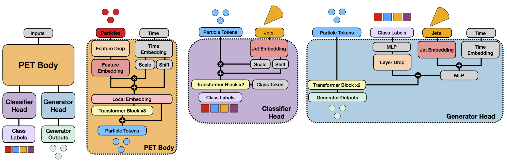

# Official Repository for the OmniLearn paper


This is the official repository used in the paper OmniLearn: A Method to Simultaneously Facilitate All Jet Physics Tasks. If you find this repository useful for your own work please cite the paper:

```
@article{Mikuni:2024qsr,
    author = "Mikuni, Vinicius and Nachman, Benjamin",
    title = "{OmniLearn: A Method to Simultaneously Facilitate All Jet Physics Tasks}",
    eprint = "2404.16091",
    archivePrefix = "arXiv",
    primaryClass = "hep-ph",
    month = "4",
    year = "2024"
}
```


# Installation

The list of packages needed to train/evaluate the model is found in the ```requirements.txt``` file. Alternatively, you can use the Docker container found in this [link](https://hub.docker.com/layers/vmikuni/tensorflow/ngc-23.12-tf2-v1/images/sha256-7aa143ab71775056f1ed3f74f1b7624e55f38108739374af958015dafea45eb3?context=repo).

Our **recommendation** is to use the docker container.

# Data

## JetClass

OmniLearn is trained using the [JetClass](https://zenodo.org/records/6619768) dataset. All files can be directly download from zenodo or downloaded using the dataloader scripts provided by the authors from the original [repository](https://github.com/jet-universe/particle_transformer/blob/main/get_datasets.py). After the files are downloaded to the folder FOLDER you can preprocess them to save new clean files in the desired format using:

```bash
cd preprocessing
python preprocess_jetclass.py --sample [train/test/val] --folder FOLDER
```

This command will create the new files in the same folder specified by the input flag.

**Notice these files can be several GB, so save them in a folder where you have a lot of storage space**

## Top Tagging Dataset

Files can be donwloaded from [zenodo](https://zenodo.org/records/2603256) and further preprocessed using the script:

```bash
cd preprocessing
python preprocess_top.py --sample [train.h5/test.h5/val.h5] --folder FOLDER
```

## Quark and Gluon dataset

Files can either be downloaded from [zenodo](https://zenodo.org/records/3164691) or directly through the [EnergyFlow](https://energyflow.network) package with the commands.

```bash
cd preprocessing
python preprocess_qg.py --folder FOLDER
```

## CMS Open Data Simulations

The 2011A release of the [CMS Open Data](https://opendata.cern.ch/record/21) can also be loaded using the EnergyFlow package as part of the MOD dataset using the following script:

```bash
cd preprocessing
python preprocess_cms.py --folder FOLDER
```

## ATLAS Top Tagging Dataset

The ATLAS Top Tagging Dataset can be downloaded from the following [link](https://opendata.cern.ch/record/15013#:~:text=The%20ATLAS%20Top%20Tagging%20Open,and%202.5%20million%20jets%20respectively) and preprocessed using the following script:

```bash
cd preprocessing
python preprocess_atlas.py --folder FOLDER --sample [train.h5/test.h5]
```

## DIS Dataset

The DIS dataset uses simulations created by the H1 Collaboration and are currently proprietary. If you are interested in this application, send me a message and we can work through!


## JetNet Dataset

The JetNet datasets can be downloaded from zenodo with [30 particles](https://zenodo.org/records/6975118) and [150 particles](https://zenodo.org/records/6975117) and similarly preprocessed with script:

```bash
cd preprocessing
python preprocess_jetnet.py --folder FOLDER --label [30/150]
```

## OmniFold Dataset

OmniFold files can be downloaded directly from [zenodo](https://zenodo.org/records/3548091) or part of the EnergyFlow package. The processing script is:

```bash
cd preprocessing
python preprocess_omnifold.py --folder FOLDER --sample [pythia/herwig]
```

## LHCO R&D Dataset

The dataset can be downloaded from [zenodo](https://zenodo.org/records/4536377)

To perform the clustering and selection of the two leading jets, [Jupyter Notebooks](https://github.com/uhh-pd-ml/FastJet-LHCO/blob/main/fastjet_awkward.ipynb) are provided to save the files in the format needed for the OmniLearn training. Additional preprocessing to split the files into training/test/validation in the signal region and sidebands can be used:

```bash
cd preprocessing
python preprocess_lhco.py --folder FOLDER 
```

# Training OmniLearn

You can either train OmniLearn from scratch or take advantage of the pre-trained checkpoint and skip this step. For the training run:

```bash
cd scripts
python train.py --dataset jetclass --lr 3e-5 --layer_scale --local --mode all
```

Since the training dataset is large, this step may take hours or days depending on the amount of resources available.

# Adapting OmniLearn to new datasets

We provide the scripts used in the paper to adapt OmniLearn to each individual task we present with evaluation scripts to derive the results shown in the paper. Notice that training any algorithm from scratch can also be accomplished by omitting the ```--fine_tune``` flag.

## Top Tagging, Quark and Gluon, CMS Open Data, DIS Classification datasets

These datasets can all be fine-tuned using the same scripts used to train OmniLearn with commands:

```bash
cd scripts
python train.py --dataset top --layer_scale --local --mode classifier --warm_epoch 3  --epoch 10 --stop_epoch 3 --batch 256 --wd 0.1 --fine_tune 
python train.py --dataset cms --lr 3e-5 --layer_scale --local --mode classifier --warm_epoch 3  --epoch 40 --stop_epoch 3 --batch 256 --wd 0.0001 --fine_tune
python train.py --dataset qg --lr 3e-5 --layer_scale --local --mode classifier --warm_epoch 3  --epoch 20 --stop_epoch 3 --batch 256 --wd 0.1 --fine_tune 
python train.py --dataset h1 --lr 3e-5 --layer_scale --local --mode classifier --warm_epoch 3  --epoch 10 --stop_epoch 3 --batch 256 --lr_factor 2 --fine_tune 
```


## ATLAS Top Tagging

For the ATLAS Top Tagging dataset we need to modify the loss function to include the event weights, requiring a different script:

```bash
cd scripts
python train_atlas.py --dataset [atlas/atlas_small]  --layer_scale --local --fine_tune
```

The evaluation for all basic classifiers is carried out using the evaluation script:

```bash
python evaluate_classifiers.py --batch 1000 --local --layer_scale --dataset [top,qg,cms,atlas,h1] [--load] --fine_tune
```

The output of the evaluation code are the metrics described in the paper for AUC, accuracy, and signal efficiency at fixed background efficiency values. The evaluation script will also run the network evaluation and save the outputs of the predictions to a npy file. If you need to evaluate the same model again, you can simply load the npy file and skip the full evaluation by providing  the ```--load``` flag. 

## OmniFold

You can run the full iterative OmniFold training using the commands::

```bash
python train_omnifold.py  --layer_scale --local --num_iter 5 --fine_tune 
```

With number of iterations determined by the ```--num_iter``` flag. The evaluation is performed with script:

```bash
python evaluate_omnifold.py --local --layer_scale [--reco] --num_iter 5
```

The ```--reco``` flag is used to load step 1 iteration 0 of the algorithm, equivalent to the event reweighting results shown in the paper.

## JetNet

To adapt OmniLearn to the JetNet data you can use the script:

```bash
python train_jetnet.py --local --layer_scale --dataset [jetnet30/jetnet150] --fine_tune
```

The JetNet dataset evaluation is performed in 2 steps. The first one we only generate samples. The second step we load the generated data and run through the scripts from the [JetNet official repo](https://github.com/jet-net/JetNet) to determine the performance. Clone the original repo first if you are interested in the metrics. The generation is dine with the following command:

```bash
python evaluate_jetnet.py --dataset [jetnet30/jetnet150] --layer_scale   --local  --fine_tune --sample
```

## LHCO

The LHCO training is performed in two steps. First we adapt the generative model using background events present in the sidebands, generate background events in the signal region, then adapt the classifier to separate data in the signal region from generated background events. The generative model is trained with the following commands:

```bash
cd scripts
python train_lhco.py --local --layer_scale --fine_tune
```

After training, background events are generated with:

```bash
python evaluate_lhco.py  --layer_scale   --local  [--SR] --sample --fine_tune
```

The same script can create plots of the generated distributions when called without the ```--sample``` flag. You can also generate predictions for the sidebands by omitting the ```--SR``` flag.

From the generated samples, you can train the classifier with the commands:

```bash
python classify_lhco.py --local --layer_scale [--ideal] [--SR] --nsig NSIG --fine_tune
```

The ```--ideal``` flag trains a classifier using true background events, used in the weakly-supervised results displayed in the paper. The ```--nsig``` flag determined the amount of injected background events to consider during the training. The evaluation of the classifier is done with:

```bash
python evaluate_classifiers_lhco.py --batch 100 --local --layer_scale [--ideal] --nsig NSIG --fine_tune
```


# Multi-GPU Training and Inference

All training scripts, evaluation scripts, and generation scripts (for generative models) can be run in parallel using multiple GPUs. This is accomplished using [Horovod](https://horovod.ai/). Horovod can either be installed separately, as part of the requirements package, but already comes as part of the docker container linked in the top of the repository. On the Perlmutter supercomputer, one can use the SLURM submission system to run the scripts with multiple GPUs using the command

```bash
srun --mpi=pmi2 shifter python [train.py]
```

for example.

# Adapt your own dataset

## Dataset creation

You can easily include new datasets and benefit from the OmniLearn training! For any task, the first step is to prepare the data to have the same format as the data used in this work. This means creating an ```.h5``` file that contains 3 groups of data:

1. ```data```: Contains the point clouds used for inputs. The expected shape is (N,P,F) where N is the total number of events, P is the maximum number of particles to be used and F is the number of features per particle. For best results use the same set of features used to train OmniLearn. These features can be found in any of the preprocessing scripts under the preprocess folder. Notice that OmniLearn does not enforce a fixed number of particles and can adapt to any dataset.
2. ```jet```: Contains the kinematic information for jets. The expected shape is (N,J) with J the number of features per jet. For best results, we use J = 4 with features (jet pT, jet eta, jet mass, particle multiplicity), but any other combination may still work well.
3. ```pid```: These contain the class labels for the classification task. For best results we one_hot_encode the labels. This can be accomplished directly at the level of the preprocessing or done later inside the Dataloader class.

With the dataset created the next step is to add a subclassed dataset object to the ```utils.py``` file.
For simple applications look at the ```TopDataLoader``` subclassed dataloader for an example. Notice that we use a preprocessing that shifts the mean of the data to 0 and sets the standard deviation to unit, based on the JetClass data. If your dataset has similar ranges for each feature, then keeping the preprocessing from jetclass will result in better results. You can also override the preprocessing parameters in case your data has different features or very different ranges. Look at the ```H1DataLoader``` for an example. You can also plot the input distributions to verify that each feature is consistent by running:

```bash
python plotter.py --dataset yourdata
```

by adding your new dataloader object to the plotter.py script. Notice that the created plots will be already normalized.

## Training

The minimum addition to be able to train your OmniLearn-powered classifier is to add your dataloader to the ```train.py``` script and start the training with commands:

```bash
python train.py --dataset YOURDATA --layer_scale --local --mode classifier --warm_epoch 3  --epoch 10 --stop_epoch 3 --batch 256 --wd 0.1 --fine_tune 
```

Tune the number of epochs and early stopping based on the size of your dataset (smaller datasets are quick to start overtraining, so no many epochs are needed). If you need to include event weights in the training procedure, look at the ATLAS Top tagging training script ```train_atlas.py``` where we modify the classifier loss function to handle the event weights.

For generative models, the same script can be used in case you only need the point cloud generation. This can be accomplished by calling

```bash
python train.py --dataset YOURDATA --layer_scale --local --mode generator --warm_epoch 3  --epoch 100 --stop_epoch 30 --batch 256 --wd 0.1 --fine_tune 
```

Similarly, change the number of epochs and early stopping based on the size of your dataset. In case you need the jet generation to be determined simultaneously during training (such is the case for both LHCO and JetNets datasets), you can create a new subclassed model that loads OmniLearn as part of the model. In this case, take a look at the ```train_jetnet.py``` script where we load a subclassed model named ```PET_jetnet``` stored in the ```PET_jetnet.py``` file.

## Evaluation

The evaluation of the trained classifier can be carried out directly from the script

```bash
python evaluate_classifiers.py --batch 1000 --local --layer_scale --dataset YOURDATA [--load] --fine_tune
```

after including your dataloader in the script. For data generation, you can create your scripts based on the evaluation scripts for jetnet to accomplish the sampling. Additional plotting functionality can be used to compare generated samples with data. Look at the evaluation scripts for the LHCO application for more details.